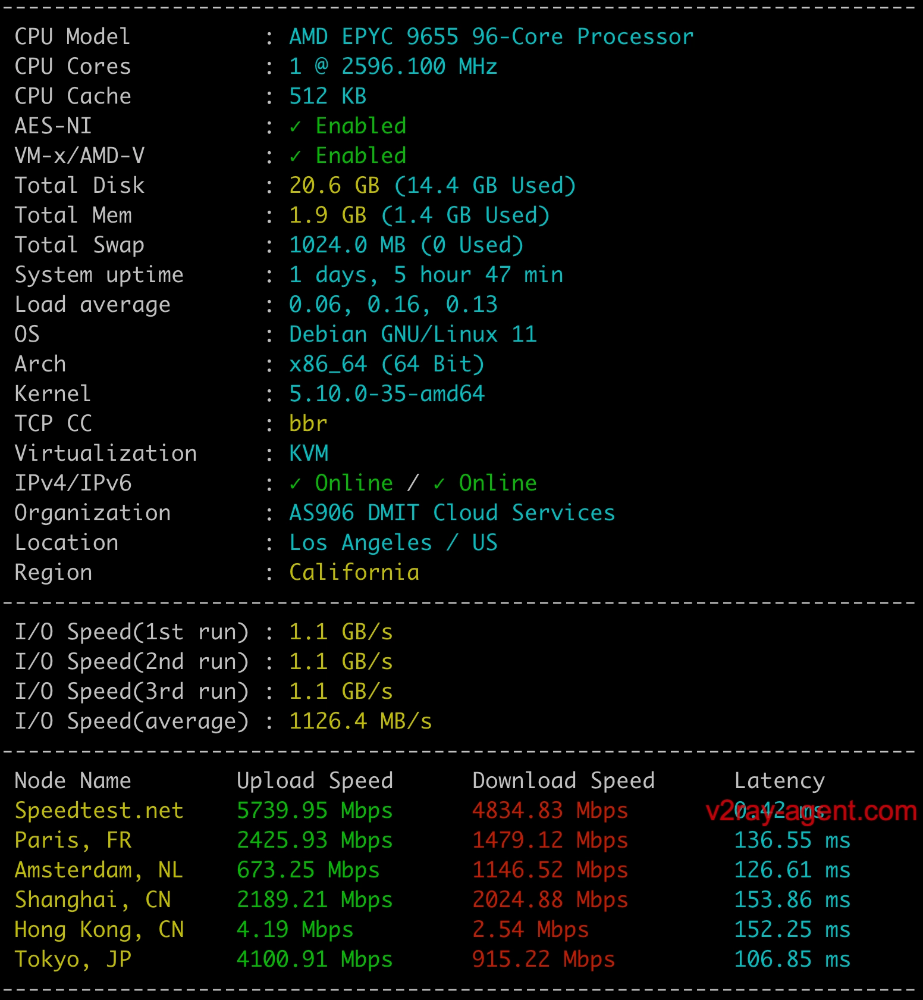
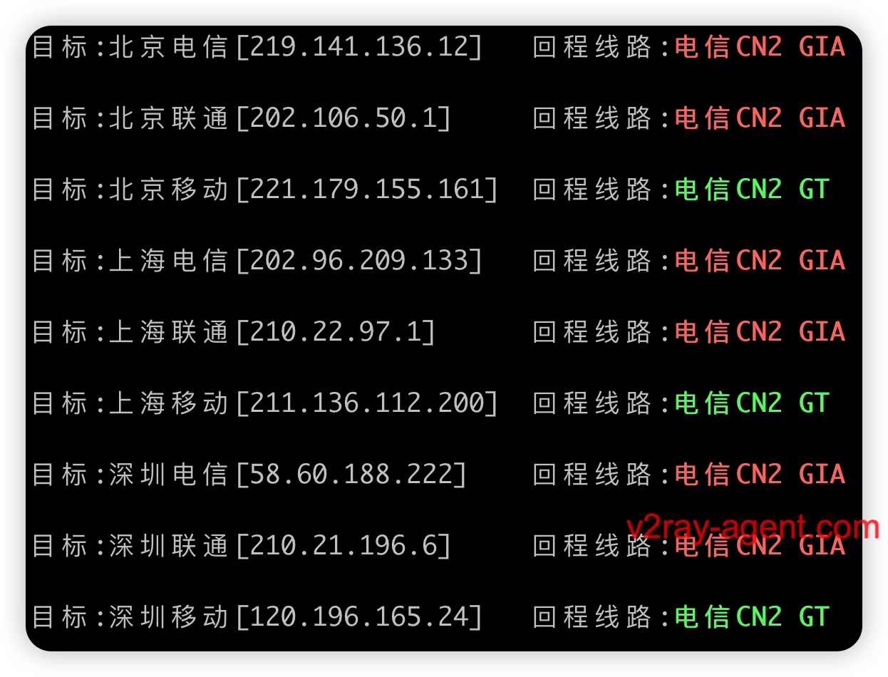
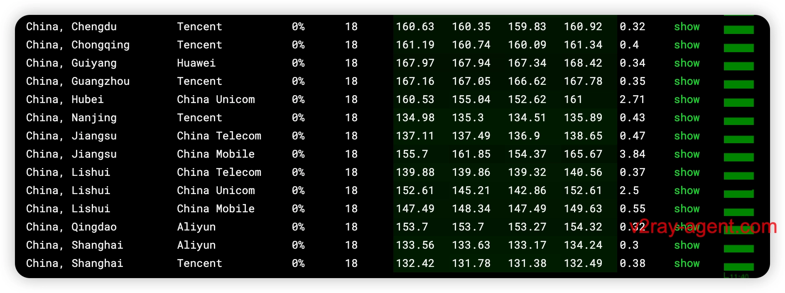

# DMIT AN5 Premium Pro Three-Network CN2 GIA Review: Top-Tier Performance Worth Every Penny

---

Looking for a VPS that actually delivers on speed promises to mainland China? DMIT's AN5 Premium Pro might be your answer. This isn't another budget VPS struggling with peak-hour congestion—we're talking genuine CN2 GIA lines across all three major carriers, backed by fifth-gen AMD EPYC 9005 processors. Whether you're running latency-sensitive applications or need reliable streaming access, this review covers what you actually care about: real-world performance, network routing quality, and whether the premium price tag makes sense.

---

## What Makes DMIT Stand Out?

DMIT launched around 2017-2018 by an overseas Chinese team, headquartered in New York. Unlike resellers slapping "optimized for China" labels on generic infrastructure, DMIT owns their hardware, software, and network resources end-to-end. This control shows in their reputation—they're known for speed and stability, often selling out their CN2 GIA inventory.

The company now runs on **fifth-generation AMD EPYC "Turin" 9005 series processors** based on Zen 5 architecture. That's industry-leading hardware, not leftovers from data center upgrades.

One practical perk: **free IP replacement within 15 days** of purchase (7 days if you grab their IP Care+ addon). Check their [TOS IP Replacement Policy](https://www.dmit.io/pages/tos) for details. When your allocated IP hits a blacklist or geo-restriction, this matters more than any spec sheet.

After bandwidth exhaustion, service continues at 4Mbps unlimited—no hard cutoff. For users with sufficient budget who'd rather pay once than troubleshoot routing issues at 2 AM, this is a no-brainer choice.

## Live Probe Data

Real-time monitoring available at [Probe Address](https://ping.v2ray-agent.com/#/3)

## Performance Benchmarks

The migration to **fifth-gen EPYC "Turin" 9005 series (Zen 5 architecture)** brings measurable improvements over previous generations. These aren't incremental upgrades—we're seeing substantial single-thread gains and better memory bandwidth.

The benchmark shows consistent high scores across CPU, disk I/O, and network tests. For comparison shopping, note that many "premium" providers still run Zen 2 or earlier—you're paying for current-gen silicon here.

## Network Routing Analysis

Here's where theory meets reality. The routing traceroute confirms true CN2 GIA paths across all three major Chinese carriers (China Telecom, China Unicom, China Mobile). No sudden hops through congested CU169 backbones during peak hours.

Clean, direct routes with minimal hops. That's what you're paying the premium for—predictable latency when it matters.

If you're evaluating VPS options for China-optimized connectivity, understanding the difference between CN2 GT and CN2 GIA matters. 👉 [Discover why DMIT's true CN2 GIA routing delivers consistently lower latency and better stability than mixed-backbone alternatives](https://www.dmit.io/aff.php?aff=13832)

## Streaming & Media Access

Tested against major streaming platforms with native IP detection:

Clean residential-scored IP addresses help here. Not every use case needs streaming access, but when you do, blocked IPs waste time.

## Latency Testing

Nationwide latency measurements across China:

Sub-200ms latency to most regions. Southern China (closer to Hong Kong) sees better numbers, but northern routes hold up well during evening peak hours.

## IP Reputation Score

Clean IP matters more than raw bandwidth specs:

Low fraud scores mean your IP isn't recycled from previous abusers. This affects everything from email deliverability to whether Netflix gives you the good library.

For businesses or power users tired of playing IP lottery with budget providers, knowing your addresses come clean out of the gate matters. The combination of [proper CN2 GIA routing and pristine IP allocation](https://www.dmit.io/aff.php?aff=13832) explains why DMIT maintains such strong word-of-mouth despite premium pricing.

---

## Bottom Line

DMIT AN5 Premium Pro delivers what it promises: genuinely fast, stable connectivity to mainland China via true CN2 GIA routing, powered by current-gen hardware. You're not getting bargain-bin pricing, but you're also not getting 2 AM routing disasters or blacklisted IPs.

For users who value their time over chasing the absolute cheapest monthly rate, this setup makes sense. The hardware is top-tier, the network routing is verifiable, and the IP replacement policy covers the most common pain point. That's why DMIT consistently sells out despite higher prices—the infrastructure actually works when you need it.

If you're evaluating premium VPS options for China-optimized scenarios, [DMIT's proven track record and end-to-end infrastructure control](https://www.dmit.io/aff.php?aff=13832) make it a solid choice worth the investment.
